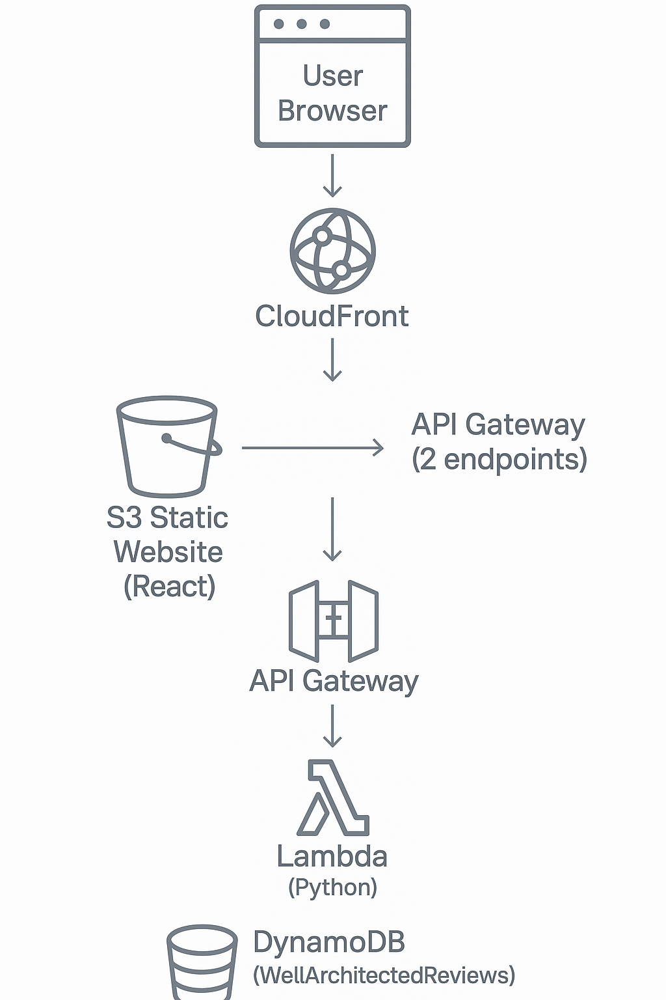

# 🏗️ AWS Well-Architected Review Simulator

This is a serverless web application that simulates an AWS Well-Architected Review. Users answer questions across the five AWS pillars and receive actionable feedback.

## 🔍 Purpose

- Educate and simulate AWS Well-Architected reviews
- Showcase serverless design using real AWS services
- Demonstrate Solution Architect knowledge and DevOps deployment

## 🧰 Tech Stack

- **Frontend:** React + Bootstrap (S3 + CloudFront)
- **Backend:** Python Lambda, API Gateway, DynamoDB
- **Infra-as-Code:** AWS SAM
- **CI/CD:** GitHub Actions (optional)

## 📊 Architecture

## 🚀 Live Demo

You can deploy your own copy or run locally with `npm run dev`.

## 💰 Cost Estimate (Free Tier)

| Service      | Billing Mode        | Est. Cost     |
|--------------|---------------------|---------------|
| Lambda       | 1M reqs/month       | $0 (Free Tier)|
| API Gateway  | 1M REST calls       | $0 (Free Tier)|
| DynamoDB     | PAY_PER_REQUEST     | ~$0.01–$0.10  |
| S3 + CF      | Static hosting      | ~$0.10/month  |

## 📁 Project Structure

aws-well-architected-review-simulator/
├── backend-api/ # AWS SAM app
├── frontend/ # React + Vite
├── data/ # Sample JSON questions
├── architecture/diagram.drawio.png
├── README.md
├── deployment.md

👨‍💻 Author
Hector Vidal
🎯 AWS Certified Cloud Practitioner | AWS Solutions Architect – Associate (in progress)
🧳 More Projects
- - [📬 Multi-Tier Guest Registration App]  (https://github.com/hcky1999/AWS-Serverless-MultiTier-Guest-Form-App)
